# FeaturePoll 🗳️

**Let your users shape your project's future with community-driven feature polling!**

FeaturePoll is a powerful Magento extension that helps you gather community feedback on features, test development directions, and feel the pulse of your user base. Whether you're deciding which features to build next, exploring new project directions, or understanding user preferences, FeaturePoll makes community-driven development simple and secure.

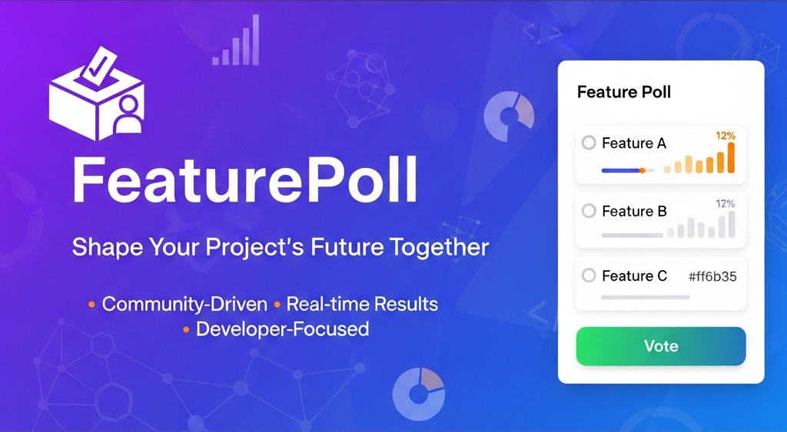

## ✨ Why Choose FeaturePoll?

- **🎨 Beautiful UI**: Modern, responsive design that encourages participation
- **🔒 Enterprise Security**: Multi-layer protection with OTP, ReCaptcha, and fraud detection
- **📱 Mobile-First**: Seamless polling experience across all devices
- **📈 Real-Time Insights**: Live results showing community sentiment and preferences
- **⚡ Easy Setup**: Deploy feature polls in minutes through the admin panel
- **🌍 Community-Focused**: Include both registered users and community guests

## 🚀 Key Features

### 🗳️ Feature Polling & Direction Testing
- **Multiple Poll Support**: Create unlimited feature polls and direction surveys
- **Flexible Questions**: Radio button options with detailed feedback capabilities
- **Admin Grid Interface**: Easy poll management through intuitive admin panel
- **Strategic Placement**: Choose exactly where and which polls to display

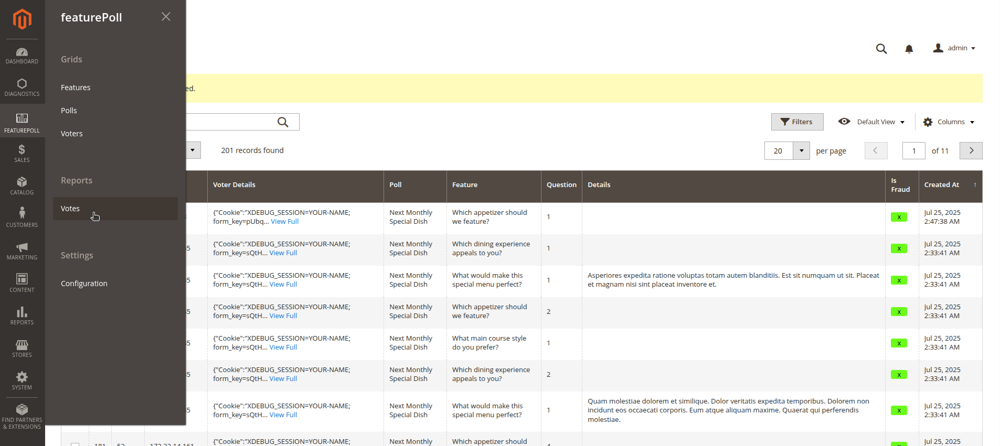
*[📸 Screenshot: Admin panel poll management]*

### 🛡️ Advanced Security
- **Two-Layer Protection**:
  - **Layer 1**: ReCaptcha validation and OTP verification for guests
  - **Layer 2**: IP tracking and user information logging
- **Fraud Detection**: Admin can review and mark suspicious votes as fraudulent
- **Guest Participation**: Secure voting for community members and guests

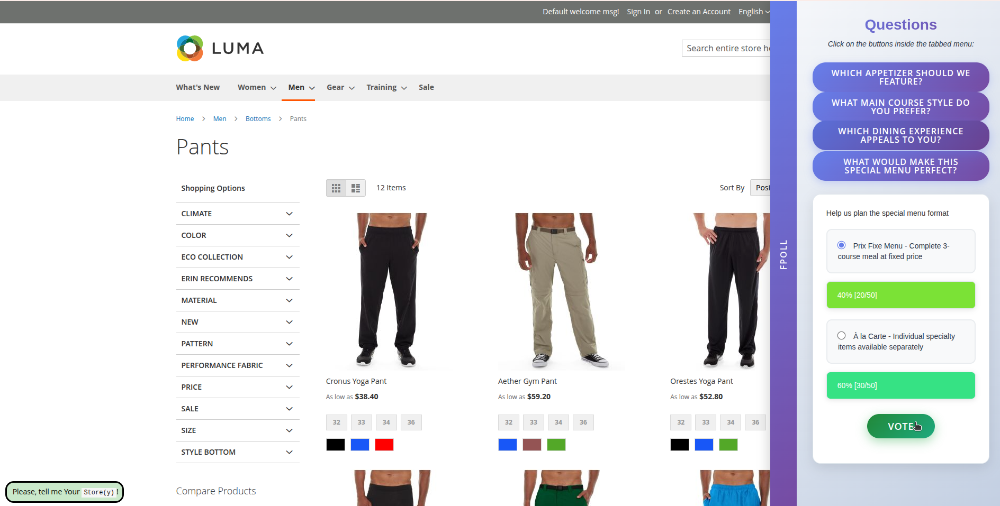
*[📸 Screenshot: Voting]*

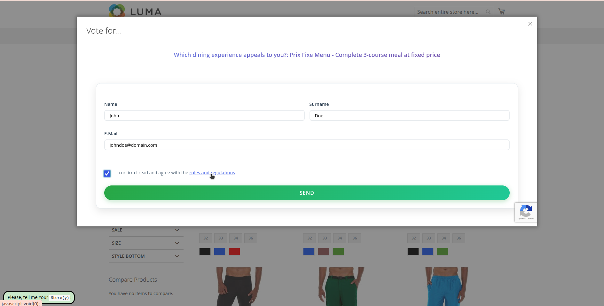
*[📸 Screenshot: OTP form for verification]*

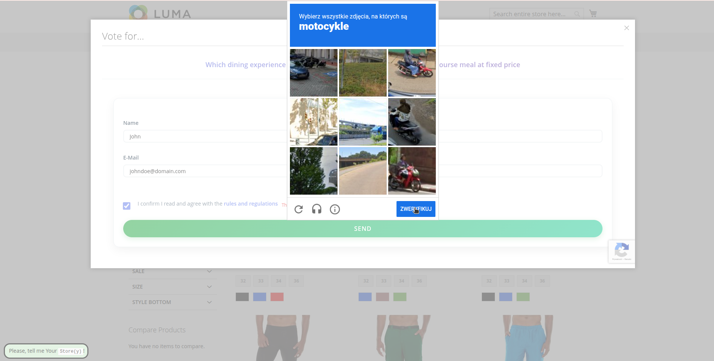
*[📸 Screenshot: reCaptcha verification]*

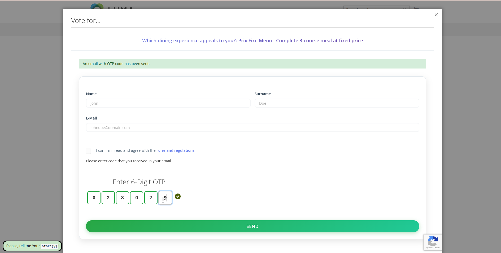
*[📸 Screenshot: OTP verification]*

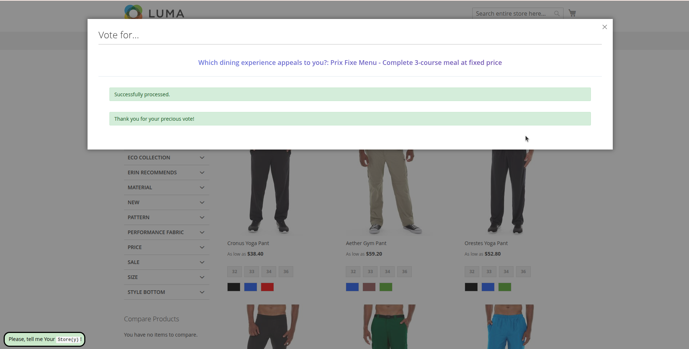
*[📸 Screenshot: Vote Success]*

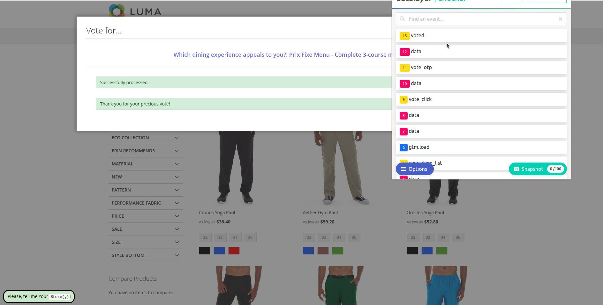
*[📸 Screenshot: Vote Success - GTM events]*

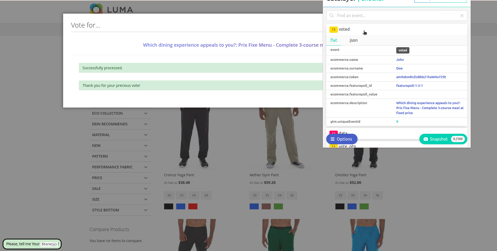
*[📸 Screenshot: Vote Success - GTM events - voted]*

### 📊 Community Insights & Analytics
- **Live Results**: Real-time percentage displays showing community preferences
- **Feature Popularity Charts**: Visual representations of feature demand
- **Detailed Analysis**: Comprehensive vote analysis with filtering options
- **Community Feedback**: Drill-down into individual responses and detailed suggestions
- **User Tracking**: Find specific feedback by email or user segment

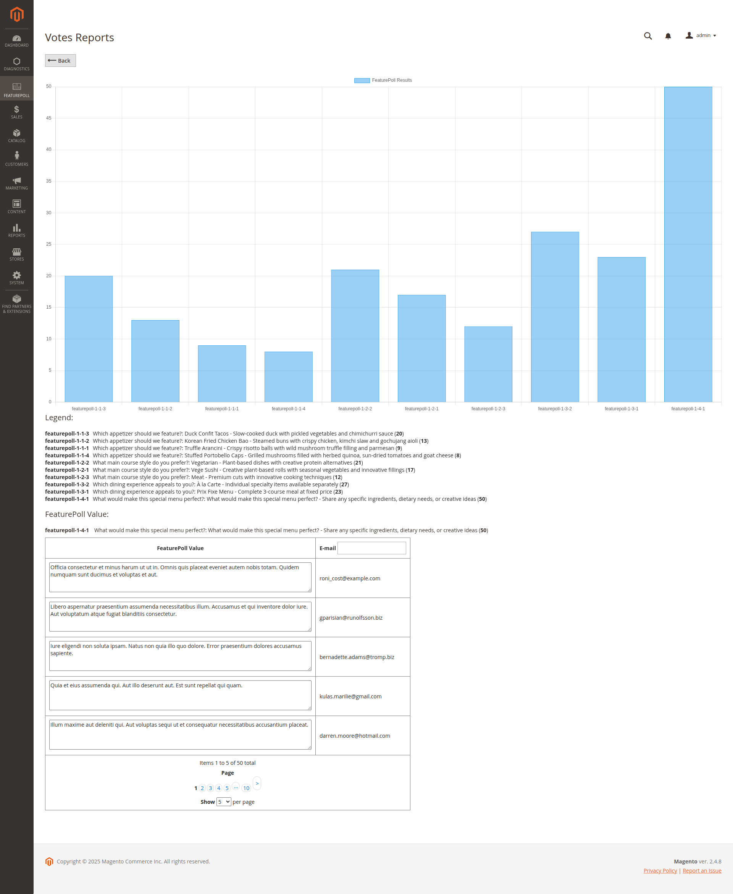

*[📸 Screenshot: Analytics dashboard with feature popularity charts]*

### 🎯 Community Experience
- **Engaging Interface**: Beautiful sliding panel that draws user attention
- **Mobile Optimized**: Touch-friendly controls perfect for community engagement
- **Transparent Results**: Show community sentiment in real-time
- **Configurable Visibility**: Control when and how results are displayed

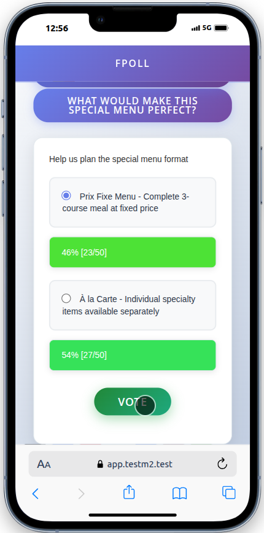

*[📸 Screenshot: Mobile interface and responsive design]*

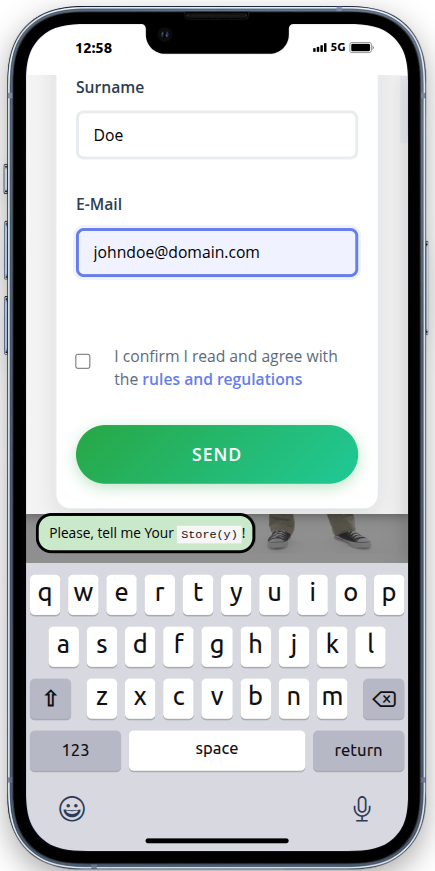

*[📸 Screenshot: Mobile interface and responsive design]*

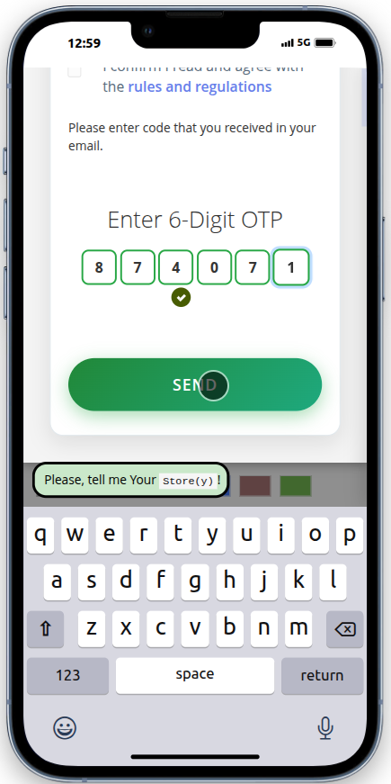

*[📸 Screenshot: Mobile interface and responsive design]*

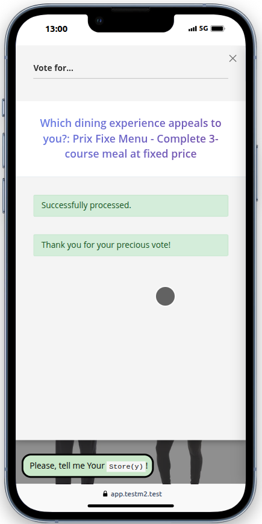

*[📸 Screenshot: Mobile interface and responsive design]*


# Installation Guide
You can find the module on [Packagist](https://packagist.org/packages/jaroslawzielinski/featurepoll-m2). To install:
```shell
cd YourProject
composer require jaroslawzielinski/featurepoll-m2
```

## 🛠️ Quick Setup Guide

### 1. Create Your First Feature Poll
- Navigate to **Admin Panel Menu > FEATUREPOLL > Grids > Features**
- Click **"Add New Feature"**
- Configure your feature options and questions
- Hit Save Feature button

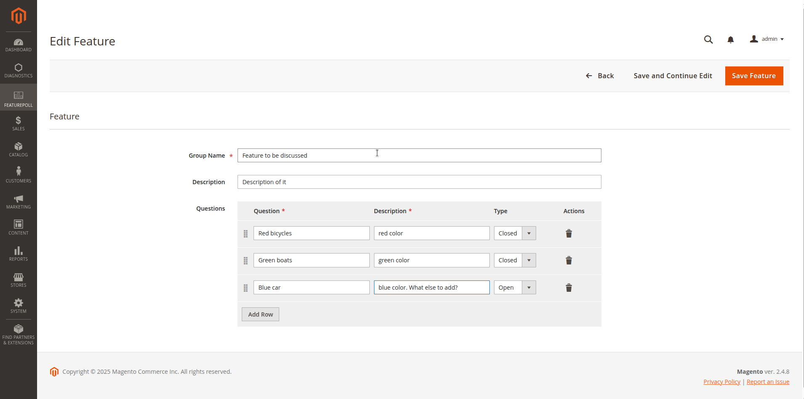
*[📸 Screenshot: Feature creation interface]*

- Navigate to **Admin Panel Menu > FEATUREPOLL > Grids > Polls**
- Click **"Add New Poll"**
- Configure your Poll -> Feature association (you may change order)
- Hit Save Poll button

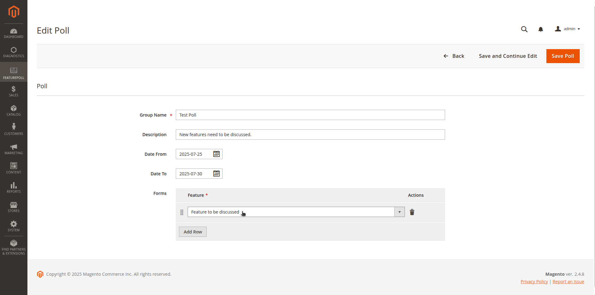
*[📸 Screenshot: Poll creation interface]*

### 2. Configure Community Engagement
- Choose target pages for poll display
- Select which polls to show to different user segments
- Configure visibility and participation options

### 3. Launch & Feel the Pulse
- Deploy your polls to gather community feedback
- Monitor real-time community sentiment
- Make data-driven development decisions

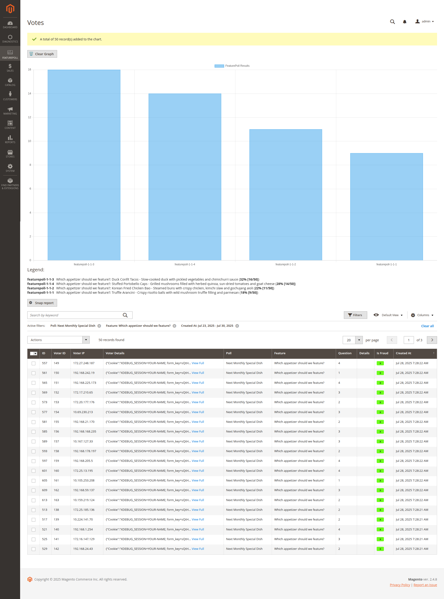
*[📸 Screenshot: Real-time community sentiment monitoring]*

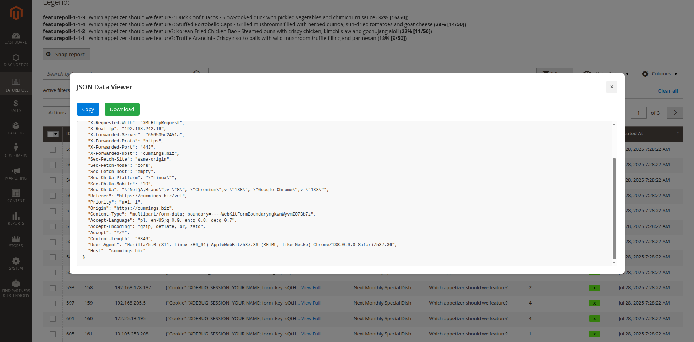
*[📸 Screenshot: Real-time community sentiment monitoring - after clicking View Full details]*

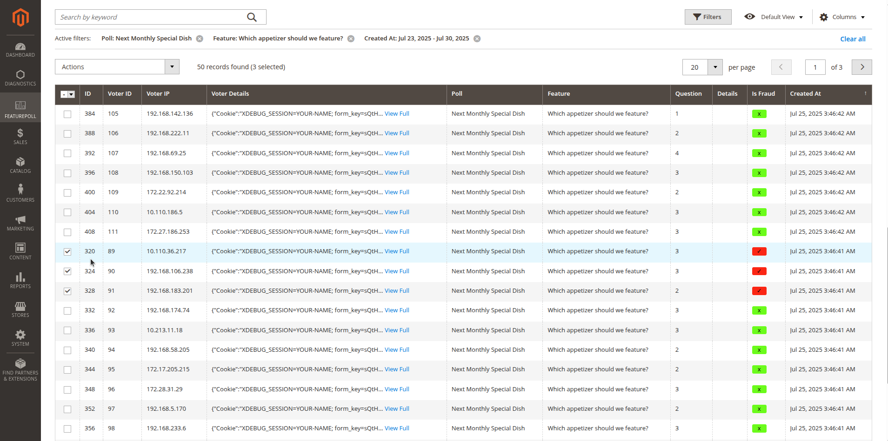
*[📸 Screenshot: Real-time community sentiment monitoring - you as admin user may select some of votes as Fraud (exlude them in Results)]*

## 🔧 Configuration Options

| Feature | Description | Admin Control |
|---------|-------------|---------------|
| **Display Strategy** | Choose where feature polls appear | ✅ Full control |
| **Results Transparency** | Show/hide community sentiment | ✅ Configurable |
| **Guest Participation** | Allow broader community input | ✅ Enable/disable |
| **OTP Verification** | Security for guest participants | ✅ Required for guests |
| **Fraud Detection** | Manual review of suspicious votes | ✅ Admin marking |

## 🎯 Perfect For:

- **🔧 Open Source Projects**: Gather community input on feature priorities
- **🏢 Product Development**: Test user appetite for new directions
- **🚀 Startups**: Validate feature ideas before development
- **🏪 E-commerce**: Understand customer feature preferences
- **📱 App Development**: Prioritize features based on user demand

## 🔗 Dependencies

This project depends on:
- **[OTPComponent-M2](https://github.com/JaroslawZielinski/OTPComponent-M2)** - Secure OTP verification system (also by the same author)

## 🤝 Support & Contribution

### ☕ Buy Me a Coffee

If FeaturePoll helps you make better development decisions and you'd like to support continued development:

[](https://buymeacoffee.com/jaroslawzielinski)

Your support helps fund:
- 🐛 Bug fixes and security updates
- ✨ New features and community-requested improvements
- 📚 Documentation and tutorials
- 🎯 Community support and feature development

### 🤝 Contributing

We welcome contributions! Whether it's:
- 🐛 Bug reports
- 💡 Feature suggestions (practice what we preach!)
- 📝 Documentation improvements
- 🔧 Code contributions

## 📄 License

This project is licensed under the MIT License - see the [LICENSE](LICENSE) file for details.

## 📞 Need Help?

- 📧 **Email**: jarek.zielinski82@gmail.com
- 💬 **GitHub Issues**: [Report bugs or request features](https://github.com/JaroslawZielinski/FeaturePoll-M2/issues)

---

**Ready to let your community shape your project's future?** 
[⬇️ Download FeaturePoll Now](https://github.com/JaroslawZielinski/FeaturePoll-M2/releases) and start making data-driven development decisions!

*Made with ❤️ for the Magento community*
